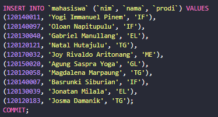
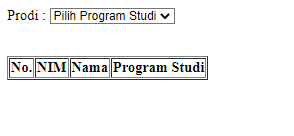
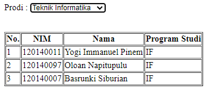
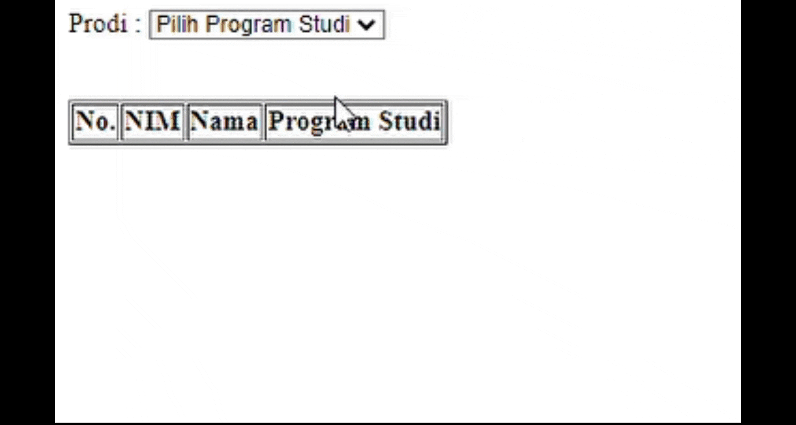

# Pertemuan 5
Tugas Praktikum Pemrograman Web RC Jadwal C Pertemuan 5

Yogi Immanuel Pinem_120140011

> Membuat aplikasi web yang dapat menampilkan data mahasiswa ketika pengguna melakukan
perubahan pada pilihan program studi yang tersedia menggunakan bantuan AJAX.
> - Aplikasi terhubung ke database yang memiliki tabel mahasiswa dengan minimal 3 data
yaitu NIM, Nama, dan Program Studi.
> - Terdapat minimal 10 baris data mahasiswa.

Berikut merupakan hasil dari tugas yang dikerjakan

Data Tabel

Data yang saya buat berjumlah 10 data mahasiswa

Pertama Kali Dijalankan

Data yang terlihat masih kosong karena belum memilih *option* yang ada

Hasil akhir

Data yang terlihat akan sesuai dengan yang dipilih

Demo Singkat

Tampilan akan sesuai seperti di video bawah ini, terlihat bahwa pilihan pertema di *disable* dan
hanya bisa memilih sesuai opsi yang ada, jika ingin melihat pilihan pertama maka website harus di *restart*

